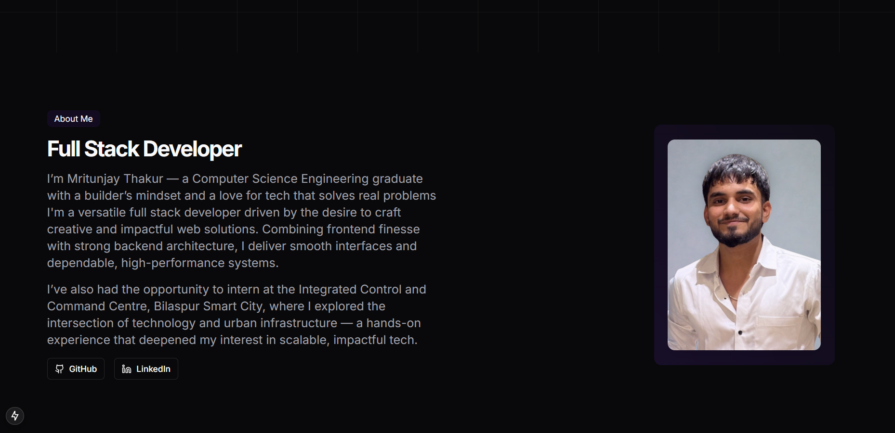
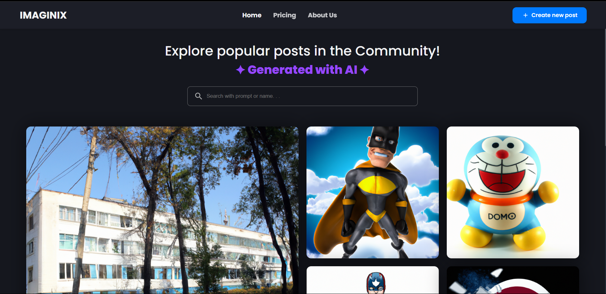

# 💼 Personal Developer Portfolio



A responsive, animated, and fully customizable **developer portfolio website** built using **Next.js**, **Tailwind CSS**, **Framer Motion**, and **TypeScript**. Showcasing skills, projects, and a contact form powered by EmailJS.

---

## 🚀 Features

- ✨ Beautiful, modern UI with smooth animations
- 💻 Projects section with GitHub & Live Demo links
- 📜 About section with profile and experience
- ⚙️ Skills tabs for frontend, backend, and tools
- 📬 Contact form with **EmailJS** integration
- 🌐 Fully responsive across all devices
- 🎯 Scroll-based animation with Framer Motion
- 💡 SEO-optimized and deploy-ready

---

## 🛠️ Tech Stack

- **Frontend**: Next.js, Tailwind CSS, Framer Motion
- **Animation**: Framer Motion
- **Icons**: Lucide Icons
- **Email**: EmailJS (no backend needed)
- **Hosting**: Vercel (recommended)

---

## 📸 Screenshots

| Landing Page | Projects Section |
|--------------|------------------|
|  |  |

---

## 📂 Folder Structure
├── components/ # UI Components (Buttons, Cards, Tabs, etc.)

├── public/ # Static Assets (Images, Icons)

├── pages/ # Next.js Pages

├── styles/ # Global CSS (Tailwind)

├── lib/ # Utility functions

└── README.md


---

## 🧪 Getting Started

1. **Clone the repository**
```bash
git clone https://github.com/mritunjay9211/Personal-Portfolio.git
cd Personal-Portfolio
```
2. **Install dependencies**
```bash
npm i
```
3. **Set up EmailJS**
Create a .env.local file in root and add:
``` bash
NEXT_PUBLIC_EMAILJS_SERVICE_ID=your_service_id
NEXT_PUBLIC_EMAILJS_TEMPLATE_ID=your_template_id
NEXT_PUBLIC_EMAILJS_PUBLIC_KEY=your_public_key
```
4. **Run locally**
```
npm run dev
```

5. **Build for production**
```
npm run build
npm start
```

## 🌍 Live Demo

Deployed using Vercel

## 🙋‍♂️ About Me
I’m Mritunjay Thakur — a Computer Science Engineering graduate & full-stack developer passionate about building real-world web applications and solving meaningful problems.


📬 mritunjaythakur2003@gmail.com

## 📃 License
This project is open source and available under the MIT License.


